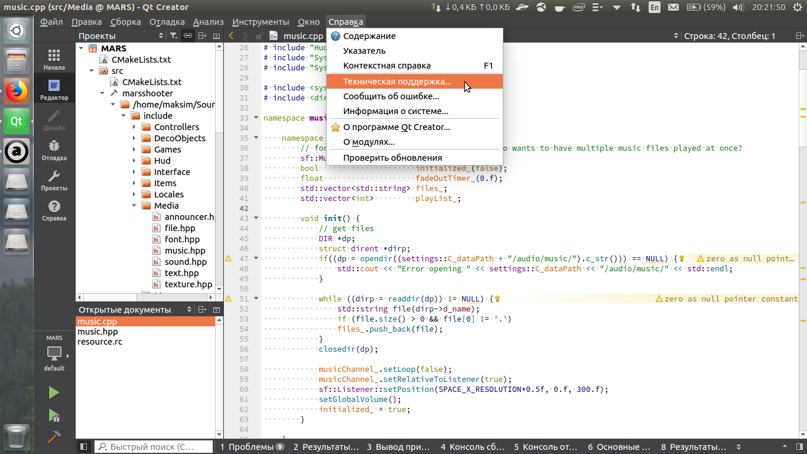

Тема оформления для Qt Creator

## Установка

Скопируйте файл `flat-unity.creatortheme` в директорию `~/Qt/Tools/QtCreator/share/qtcreator/themes`, если установили Qt Creator, скачав его с официального сайта.

Затем в настройках "Инструменты" -> "Параметры" -> "Среда" -> "Интерфейс" выберите тему "Flat Unity".